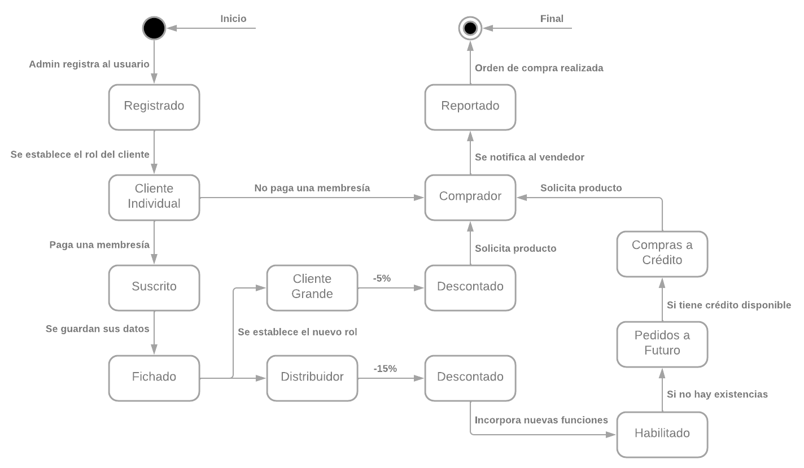
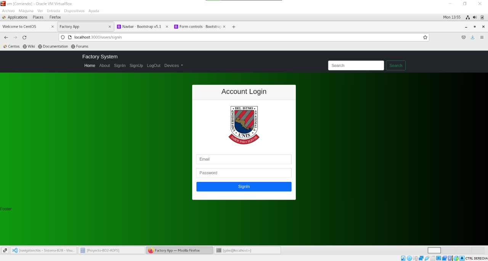
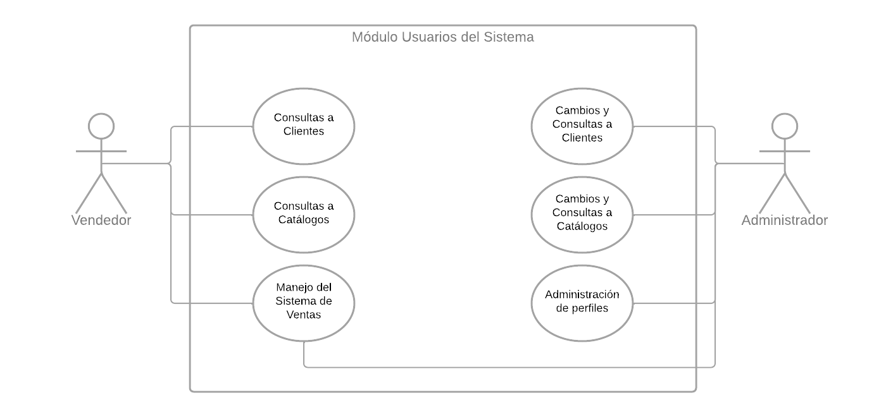
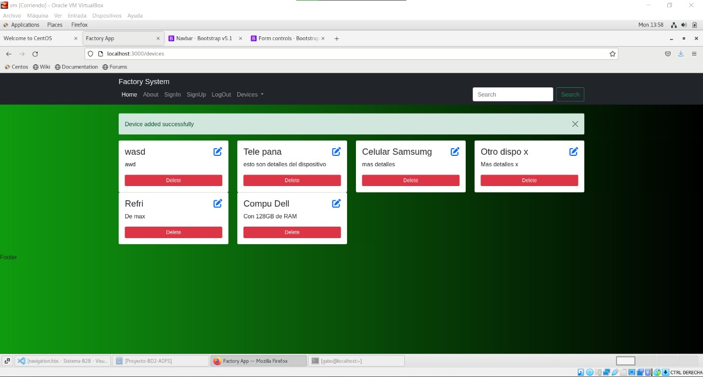

# Requerimiento Funcional y No Funcional del Proyecto de ADFS
Dylan Rodas
Facultad de Ingeniería, Universidad del Istmo, Guatemala, Guatemala.
rodas171315@unis.edu.gt

## Índice

[TOCM]

[TOC]

## Introducción
El objetivo de este documento es definir y describir los requerimientos del proyecto del Sistema B2B; proyecto interdisciplinario de las clases de Análisis, Diseño y Fabricación de Sistemas y Sistemas de Bases de Datos 2, detallando la funcionalidad del sistema y sus limitaciones.

### Alcance del documento
Este documento busca servir como registros de los requerimientos del sistema B2B, con el propósito de establecer una base para la visión, el alcance, el costo y la calendarización de las actividades necesarias para el desarrollo del producto. La definición de estos requerimientos tiene como objetivo la calidad y el rendimiento del producto final.

## DESCRIPCIÓN GENERAL

### Funciones del producto
El sistema debe de facilitar la introducción, gestión y visualización de los datos de los dispositivos manejados en los módulos de fábrica y de ventas. Además, debe permitir un flujo adecuado de las compras por parte de los clientes, así como hacer más eficiente el tiempo de todos los usuarios en general.

### Características de los usuarios
Entre los usuarios se encuentran los fabricantes y clientes del módulo de fábricas y vendedores y clientes, del módulo de ventas. En el módulo de ventas, existen tres perfiles de clientes: distribuidores, clientes grandes y clientes individuales. Los clientes individuales pueden realizar compras de forma normal; los distribuidores y grandes clientes deben de pagar una suscripción anual y reciben descuentos del 15% y 5% respectivamente. Además, los distribuidores pueden realizar compras a crédito y realizar pedidos a futuro.

### Planteamiento del problema del usuario
Se les debe permitir a los usuarios poder realizar funciones con base en el sistema en el que se encuentren, ya sea la compra de dispositivos electrónicos para su redistribución en el sistema de fábricas, o la gestión y compras de dispositivos de forma final, en el sistema de ventas.

## REQUERIMIENTOS FUNCIONALES
**Cuadro 1.** Requisito Funcional para Usuarios.

|  |  |
| ------------- | ------------- |
| Título  | Registro y Login  |
| Descripción  | La autenticación de los usuarios debe cumplirse mediante el ingreso de sus credenciales (correo electrónico y contraseña) y debe identificar a los fabricantes, vendedores y clientes, y, entre los clientes, a los clientes individuales, grandes clientes y distribuidores mayoristas.  |
| Actores e interfaces  | Usuario y la interfaz inicial de la página de registro y de inicio de sesión.  |
| Código  | RF1  |
| Input  | Credenciales de los usuarios.  |
| Output  | Validación de las credenciales y permiso de continuar hacia el dashboard correspondiente según el tipo de usuario y de la validez de las credenciales o impedir su paso, en caso de que las credenciales no sean válidas.  |
| Prerrequisitos  | Ninguno.  |
| Dependencias con otros módulos  | Después de que el módulo de autenticación de usuarios haya validado a un usuario, se le permitirá continuar al dashboard correspondiente. |

- Diagrama UML.

> **Figura 1.** Diagrama de Estado del Login.

- Vista Preliminar.

> **Figura 2.** Inicio de sesión para el usuario.

## REQUERIMIENTOS NO FUNCIONALES
**Cuadro 2.** Requisito No Funcional para Operaciones.

|  |  |
| ------------- | ------------- |
| Título  | Notificaciones de éxito en operaciones.  |
| Descripción  | Las operaciones de creación, actualización, eliminación debe incluir notificaciones de éxito al momento de culminarlas. |
| Actores e interfaces  | Los usuarios deben percibir mediante la siguiente o la misma interfaz una notificación que les indique que se operaron satisfactoriamente sus acciones.  |
| Código  | RNF8  |
| Input  | Petición del usuario en alguna operación CRUD. |
| Output  | Notificaciones en la interfaz. |
| Prerrequisitos  | Ninguno.  |
| Dependencias con otros módulos  | Deben encontrarse implementadas las interfaces de formularios y catálogos. |

- Diagrama UML.

> **Figura 3.** Casos de Uso para mostrar notificaciones.

- Vista Preliminar.

> **Figura 4.** Muestra de notificaciones.

## CONCLUSIONES

### Contexto empresarial
En un ecosistema B2B, una empresa vende un conjunto de productos o servicios a otra empresa. Este tipo de sistemas facilita el intercambio de productos, servicios o información entre distintas empresas. La importancia de los sistemas B2B radica en que todas las empresas necesitan de la adquisición de productos y servicios para poder iniciar, llevar a cabo sus actividades y crecer.

### Información sobre sistemas similares
Existen distintos productos que ofrecen capacidades de transacciones en un entorno B2B, como Salesforce B2B, Oracle SuiteCommerce y BigCommerce, entre otros. Todos estos permiten la gestión de productos de fabricantes y distribuidores. No obstante, para el desarrollo del proyecto no se estará desarrollando con base a ninguno de estos, sino que se realizará para la satisfacción de las necesidades específicas con las que se cuentan.

### Objetivos del usuario
El usuario requiere de un sistema que tenga acceso a una base de datos que almacene información sobre los dispositivos electrónicos que tiene a disposición para su venta o sobre la compra de estos dispositivos. Además, necesita que exista una comunicación entre ambos módulos para poder mostrar los dispositivos adquiridos en el módulo de fábricas para que se encuentren disponibles en el de ventas y que los clientes puedan comprarlos.

## Referencias
[1] Juan Luis Flores Pineda and Melannie Karem Barrera Andrade. Estimación de tiempos en proceso de pre-venta de proyectos usando el método de tallas de camisetas. page 3, 2022.